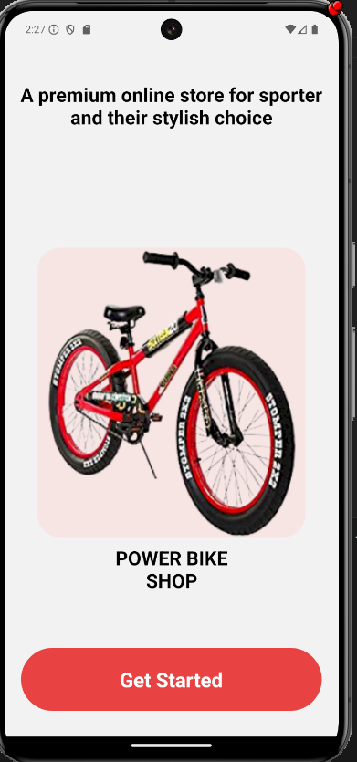
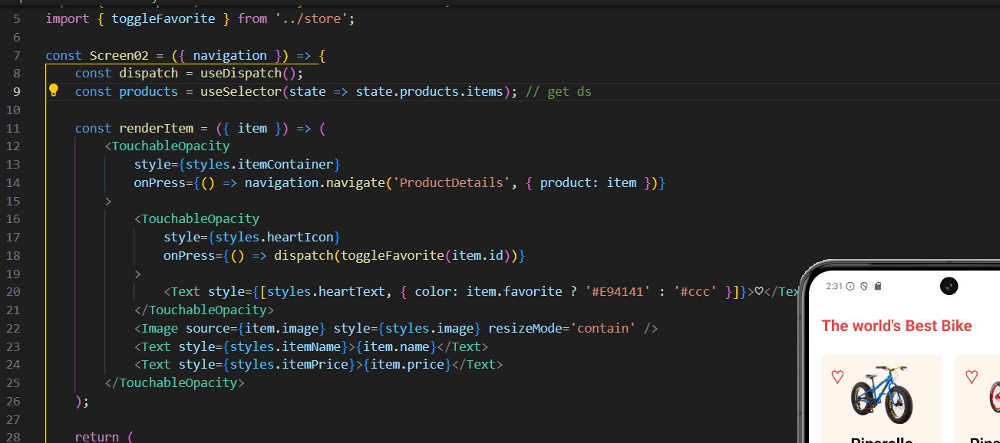

# 21006171 - Nguyễn Tống Anh Quân

### 1) Screen 01 

### 2) Screen 02

### 3) Screen 03

### 4) Sử dụng Redux tool kit để Thêm sản phẩm yêu thích
### (Ảnh 1 sản phẩm ở chế độ bình thường)

### (Ảnh 2 ở chế độ sản phẩm yêu thích (Trái tim màu đỏ))

### 5) Screen Add Product

### 6) Sản phẩm mới được Add vào API

### 7) Code Fetch API Và Thêm sản phẩm

### 8) Redux Store ở Screen02 dùng useSelector để lấy DS sản phẩm từ Redux Store

